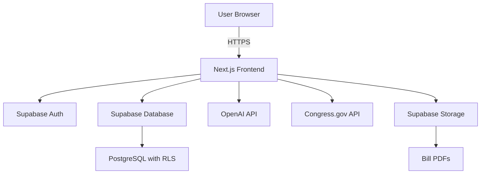

# Polisee - Personalized Legislative Impact Analyzer

<div align="center">

[](https://opensource.org/licenses/MIT)
[](https://nodejs.org)
[](https://nextjs.org)
[](https://www.typescriptlang.org)
[](https://supabase.com)

<h3>Transform complex legislative bills into personalized, verifiable impact reports for citizens</h3>

[Demo](https://polisee.demo.com) • [Documentation](https://docs.polisee.com) • [Report Bug](https://github.com/yourusername/polisee/issues) • [Request Feature](https://github.com/yourusername/polisee/issues)

</div>

## 📋 Table of Contents

- [About The Project](#about-the-project)
- [Key Features](#key-features)
- [Built With](#built-with)
- [Getting Started](#getting-started)
  - [Prerequisites](#prerequisites)
  - [Installation](#installation)
  - [Configuration](#configuration)
- [Usage](#usage)
  - [User Flow](#user-flow)
  - [API Documentation](#api-documentation)
- [Project Structure](#project-structure)
- [Development](#development)
- [Testing](#testing)
- [Deployment](#deployment)
- [Contributing](#contributing)
- [Security](#security)
- [License](#license)
- [Contact](#contact)
- [Acknowledgments](#acknowledgments)

## 🎯 About The Project

Polisee is an open-source web application that democratizes access to legislative information by transforming complex bills into personalized impact reports. Using advanced AI and Natural Language Processing, Polisee helps citizens understand how proposed legislation will directly affect their lives.

### The Problem
- **Legislative Complexity**: Bills often exceed 1,000 pages, making manual review infeasible
- **Citizen Engagement Gap**: Voters struggle to connect policy provisions to personal circumstances
- **Misinformation Risk**: AI-generated summaries without source verification can spread false information

### Our Solution
Polisee provides:
- **Personalized Analysis**: AI-generated impact reports tailored to individual user personas
- **Verifiable Claims**: Every analysis links directly to source text in the original bill
- **Admin-Managed Content**: Administrators upload and manage bills while users focus on understanding impacts
- **Sentiment Feedback**: Users can provide feedback on specific bill sections that affect them

## ✨ Key Features

- 🎭 **Multi-Step Persona Creation** - Comprehensive demographic profiling for accurate analysis
- 🤖 **AI-Powered Analysis** - OpenAI-driven personalized impact generation with RAG
- 📄 **Advanced PDF Viewer** - Full-featured PDF viewing with text highlighting and search
- 🔍 **Source Citations** - Click-to-view source text with context highlighting
- 💬 **Sentiment Feedback** - Track user opinions on specific bill impacts
- 📱 **Responsive Design** - Mobile-first UI with professional UX
- 🔐 **Secure Authentication** - Supabase Auth with role-based access control
- 📊 **Real-time Analytics** - Track engagement and feedback metrics
- 🎨 **Modern UI/UX** - Built with Shadcn UI and Tailwind CSS
- 🚀 **High Performance** - Optimized for fast analysis generation (< 30 seconds)

## 🛠 Built With

### Frontend
- [Next.js 15](https://nextjs.org/) - React framework with App Router
- [TypeScript](https://www.typescriptlang.org/) - Type-safe JavaScript
- [Tailwind CSS](https://tailwindcss.com/) - Utility-first CSS framework
- [Shadcn UI](https://ui.shadcn.com/) - Re-usable component library
- [React PDF](https://react-pdf.wojtekmaj.pl/) - PDF rendering in React

### Backend
- [Supabase](https://supabase.com/) - PostgreSQL database, Auth, and Storage
- [OpenAI API](https://openai.com/api/) - AI text generation and embeddings
- [Congress.gov API](https://api.congress.gov/) - Legislative data source
- [Resend](https://resend.com/) - Email notifications

### Infrastructure
- [Vercel](https://vercel.com/) - Frontend hosting
- [GitHub Actions](https://github.com/features/actions) - CI/CD pipeline
- [Gitleaks](https://github.com/zricethezav/gitleaks) - Security scanning

## 🚀 Getting Started

### Prerequisites

- Node.js 18+ and npm
- Supabase account (free tier available)
- OpenAI API key
- Congress.gov API key

### Installation

1. **Clone the repository**
   ```bash
   git clone https://github.com/yourusername/polisee.git
   cd polisee
   ```

2. **Install dependencies**
   ```bash
   npm install
   ```

3. **Install backend dependencies (Python)**
   ```bash
   cd backend
   pip install -r requirements.txt
   cd ..
   ```

### Configuration

1. **Create environment variables**
   ```bash
   cp .env.example .env.local
   ```

2. **Configure your `.env.local` file**
   ```env
   # Supabase Configuration
   NEXT_PUBLIC_SUPABASE_URL=your-supabase-project-url
   NEXT_PUBLIC_SUPABASE_ANON_KEY=your-supabase-anon-key
   SUPABASE_SERVICE_ROLE_KEY=your-supabase-service-role-key

   # Congress.gov API Configuration
   CONGRESS_API_KEY=your-congress-api-key

   # OpenAI Configuration
   OPENAI_API_KEY=your-openai-api-key

   # Email Configuration (Optional)
   RESEND_API_KEY=your-resend-api-key
   RESEND_FROM_EMAIL=noreply@yourdomain.com

   # Application Configuration
   NEXT_PUBLIC_APP_URL=http://localhost:3000
   ```

3. **Set up the database**
   
   Run the migration scripts in your Supabase SQL editor:
   ```bash
   # Copy the contents of these files to your Supabase SQL editor:
   - supabase/migrations/*.sql
   - local_schema.sql (for initial setup)
   ```

4. **Configure Supabase Storage**
   
   Create a bucket named `bills` in your Supabase Storage for PDF storage.

5. **Run the development server**
   ```bash
   npm run dev
   ```

6. **Access the application**
   
   Open [http://localhost:3000](http://localhost:3000) in your browser.

## 📖 Usage

### User Flow

1. **Create Persona** - Fill out demographic information (location, occupation, family status, etc.)
2. **Browse Bills** - View available legislative bills with search and filtering
3. **Get Personalized Analysis** - AI generates impact analysis tailored to your persona
4. **Review Sources** - Click citations to view exact bill text in the PDF viewer
5. **Provide Feedback** - Share your sentiment on specific bill impacts

### API Documentation

#### Core Endpoints

- `POST /api/analyze-bill` - Generate personalized bill analysis
- `GET /api/search-bills` - Search legislative bills
- `POST /api/vote-bill` - Submit sentiment feedback
- `GET /api/ai-summary/[billId]` - Get cached AI analysis

For detailed API documentation, see [API.md](docs/API.md).

## 📁 Project Structure

```
polisee/
├── src/
│   ├── app/                    # Next.js app router pages
│   ├── components/             # React components
│   │   ├── auth/              # Authentication components
│   │   ├── feedback/          # Feedback & sentiment components
│   │   ├── layout/            # Layout components
│   │   ├── persona/           # Persona creation wizard
│   │   ├── policy/            # Policy analysis components
│   │   └── ui/                # Reusable UI components
│   ├── lib/                    # Utility functions and services
│   └── types/                  # TypeScript type definitions
├── backend/                    # Python backend for bill scraping
│   └── scraper/               # Congress.gov scraper
├── supabase/                   # Database migrations
├── scripts/                    # Utility scripts
├── docs/                       # Documentation
└── public/                     # Static assets
```

## 🔧 Development

### Available Scripts

```bash
# Development
npm run dev                    # Start development server
npm run build                  # Build for production
npm run start                  # Start production server
npm run lint                   # Run ESLint

# Database
npm run db:migrate             # Run database migrations
npm run db:test                # Test database connection
npm run db:types               # Generate TypeScript types from database

# Bill Scraping
npm run scraper:initial        # Initial bill data download
npm run scraper:daily          # Daily bill updates
npm run scraper:search         # Search for specific bills

# AI Processing
npm run ai:batch-summaries     # Generate batch AI summaries
npm run ai:batch-status        # Check batch processing status

# Security
npm run security:scan          # Run security scans
npm run security:full          # Full security audit
```

### Code Style

This project uses:
- ESLint for code linting
- Prettier for code formatting
- TypeScript for type safety

### Architecture Overview



## 🧪 Testing

```bash
# Run unit tests
npm run test

# Run integration tests
npm run test:integration

# Run E2E tests
npm run test:e2e

# Test database connection
npm run db:test
```

## 🚢 Deployment

### Vercel Deployment

1. Fork this repository
2. Create a new project on [Vercel](https://vercel.com)
3. Connect your GitHub repository
4. Add environment variables in Vercel dashboard
5. Deploy!

### Self-Hosting

See [DEPLOYMENT.md](docs/DEPLOYMENT.md) for detailed self-hosting instructions.

## 🤝 Contributing

We welcome contributions! Please see our [Contributing Guidelines](CONTRIBUTING.md) for details.

1. Fork the project
2. Create your feature branch (`git checkout -b feature/AmazingFeature`)
3. Commit your changes (`git commit -m 'Add some AmazingFeature'`)
4. Push to the branch (`git push origin feature/AmazingFeature`)
5. Open a Pull Request

### Development Setup

1. Follow the installation steps above
2. Create a new branch for your feature
3. Make your changes
4. Run tests and linting
5. Submit a PR with a clear description

## 🔐 Security

- All data is encrypted in transit (HTTPS) and at rest
- Row Level Security (RLS) enabled on all database tables
- API keys stored securely in environment variables
- Regular security scans with Gitleaks and TruffleHog
- See [SECURITY.md](docs/SECURITY.md) for security policy

### Reporting Security Issues

Please report security vulnerabilities to security@polisee.com

## 📄 License

This project is licensed under the MIT License - see the [LICENSE](LICENSE) file for details.

## 📞 Contact

Project Maintainers:
- **PoliseeAI Team** - [@poliseeai](https://twitter.com/poliseeai)
- **Email** - contact@polisee.com

Project Link: [https://github.com/yourusername/polisee](https://github.com/yourusername/polisee)

## 🙏 Acknowledgments

- [Congress.gov](https://www.congress.gov/) for legislative data access
- [Supabase](https://supabase.com/) for backend infrastructure
- [Vercel](https://vercel.com/) for hosting and deployment
- [Shadcn UI](https://ui.shadcn.com/) for the component library
- The open-source community for invaluable tools and libraries

---

<div align="center">
Made with ❤️ by the Polisee Team
</div>
